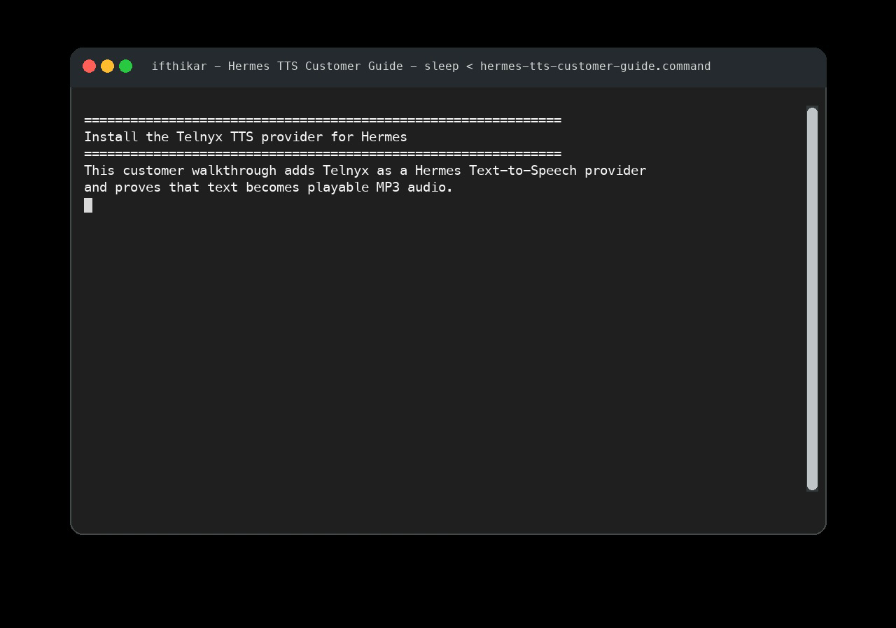

# Telnyx TTS — Hermes Agent Contribution

This repository contains the Telnyx Text-to-Speech provider implementation for
[Hermes Agent](https://github.com/NousResearch/hermes-agent).

It is **not** a standalone plugin. Hermes handles TTS through built-in providers
dispatched in `tools/tts_tool.py`. This repo contains the Telnyx provider
function and tests ready to be contributed upstream.

## What's inside

| File | Purpose |
|------|---------|
| `telnyx_tts_provider.py` | Drop-in implementation for `tools/tts_tool.py` |
| `tests/test_telnyx_tts_static.py` | AST-based constant/signature checks (no credentials) |
| `tests/test_telnyx_tts_runtime.py` | Full protocol test with mocked WebSocket (no credentials) |
| `tests/test_telnyx_tts_live.py` | Live API test (requires `TELNYX_API_KEY`) |

## Setup Walkthrough

Watch the full setup walkthrough:
[](docs/assets/hermes-tts-setup-walkthrough.mp4)

## Integration into hermes-agent

### 1. Add to `BUILTIN_TTS_PROVIDERS`

```python
BUILTIN_TTS_PROVIDERS = frozenset({
    # ... existing providers ...
    "telnyx",
})
```

### 2. Add to `PROVIDER_MAX_TEXT_LENGTH`

```python
PROVIDER_MAX_TEXT_LENGTH: Dict[str, int] = {
    # ... existing entries ...
    "telnyx": 5000,
}
```

### 3. Copy the provider function

Copy `_generate_telnyx_tts` from `telnyx_tts_provider.py` into
`tools/tts_tool.py`, placing it near the other `_generate_*` functions.

> **Note:** when integrating, replace the call to `_get_env_value` inside the
> function with the existing module-level `get_env_value` in `tts_tool.py`.

### 4. Add the dispatch branch

In `text_to_speech_tool`, add after the `piper` branch and before the `else`:

```python
elif provider == "telnyx":
    logger.info("Generating speech with Telnyx TTS...")
    _generate_telnyx_tts(text, file_str, tts_config)
```

### 5. Install the dependency

```bash
pip install websockets
```

Add `websockets` to `pyproject.toml` / `requirements.txt` in hermes-agent.

## Provider details

| Field | Value |
|-------|-------|
| Provider ID | `telnyx` |
| WebSocket endpoint | `wss://api.telnyx.com/v2/text-to-speech/speech?voice=<voice>` |
| Default voice | `Telnyx.NaturalHD.astra` |
| Output format | MP3 |
| Auth | `TELNYX_API_KEY` (Bearer) |
| Endpoint override | `TELNYX_TTS_BASE_URL` env var |

## WebSocket protocol

```
Client → Server:  connect to /speech?voice=<voice>
Client → Server:  {"text": " "}                                                # init
Client → Server:  {"text": "<your text>"}                                      # content
Client → Server:  {"text": ""}                                                 # stop

Server → Client:  {"audio": "<base64 mp3 chunk>", "isFinal": false}            # chunk
Server → Client:  {"audio": "<base64 mp3 chunk>", "isFinal": true}             # final
```

The client decodes and concatenates `audio` fields until `isFinal` is `true`.

## User configuration (`~/.hermes/config.yaml`)

```yaml
tts:
  provider: telnyx
  telnyx:
    voice: Telnyx.NaturalHD.astra   # optional, this is the default
    # base_url: wss://...           # optional endpoint override
```

## Available voices

Full catalog via `GET /v2/text-to-speech/voices` with a valid `TELNYX_API_KEY`.

Representative defaults:

| Family | Example voices |
|--------|---------------|
| `Telnyx.NaturalHD` | `astra`, `luna`, `orion`, `celeste`, `bond`, `andromeda` |
| `Telnyx.KokoroTTS` | `af_alloy`, `af_bella`, `am_adam`, `am_michael` |
| `Telnyx.Natural` | (see live catalog) |
| `Telnyx.Ultra` | (see live catalog) |

## Running tests

```bash
# No credentials needed
python -m pytest tests/test_telnyx_tts_static.py tests/test_telnyx_tts_runtime.py -q

# Live test (requires TELNYX_API_KEY)
export TELNYX_API_KEY=***
python -m pytest tests/test_telnyx_tts_live.py -q
```

## Linear

AIF-193

## References

- [Telnyx TTS API docs](https://developers.telnyx.com/docs/voice/programmable-voice/tts)
- [Telnyx API keys](https://portal.telnyx.com/#/app/api-keys)
- [hermes-agent tts_tool.py](https://github.com/NousResearch/hermes-agent/blob/main/tools/tts_tool.py)
